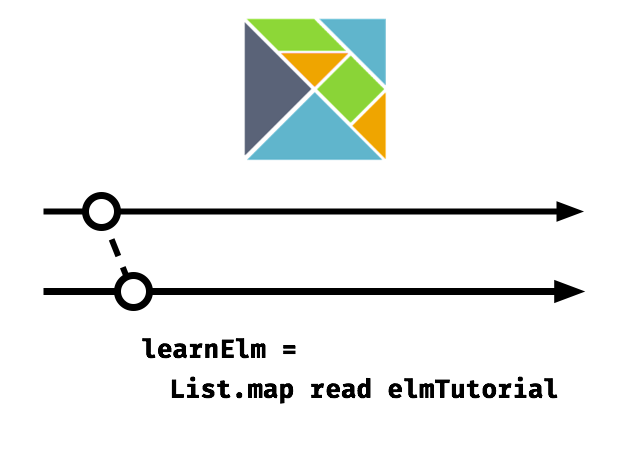

# Elm 指南

__这是一个使用 [Elm](http://elm-lang.org/) 来开发单页应用程序的指南。__

这篇指南包含：

- Elm 基础
- 理解 Elm 的 signals
- 理解 Elm 架构
- 组合子组件和资源
- 整合 CSS
- 数据获取和转义 JSON
- 路由
- CRUD 操作

[在线阅读](http://www.elm-tutorial.org/)。

离线版本下载 [(PDF, ePub, Mobi)](https://www.gitbook.com/book/sporto/elm-tutorial/details)。

## 示例代码

指南第二部分的代码可以在这里找到 <https://github.com/sporto/elm-tutorial-app>。

## 依赖

这个指南需要:

- Elm 版本为 0.17 (如何安装已包含在指南中)
- Node JS 版本为 4 以上

## 贡献

可以 <https://github.com/sporto/elm-tutorial> 提交 issues 和 PRs。

---

[Share on Twitter](https://twitter.com/intent/tweet?&text=Elm%20Tutorial&url=http%3A%2F%2Fwww.elm-tutorial.org&via=sebasporto) | [Follow @sebasporto](https://twitter.com/intent/user?screen_name=sebasporto)

 This work is licensed under a <a rel="license" href="http://creativecommons.org/licenses/by-nc-sa/4.0/">Creative Commons Attribution-NonCommercial-ShareAlike 4.0 International License</a>.

© Sebastian Porto 2016
